 [text](../../../../..)
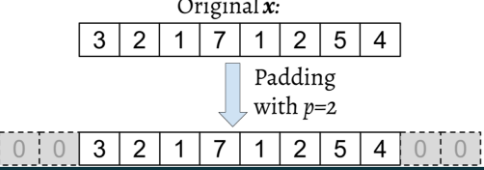
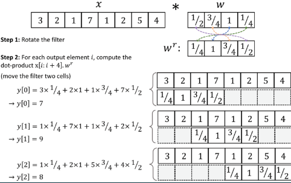
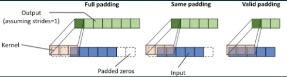
https://arxiv.org/abs/1412.6806
Performing a discrete convolution in 2D
    
[text](../../../../..)
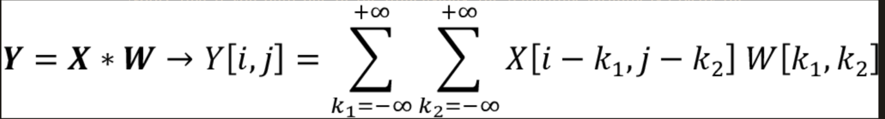
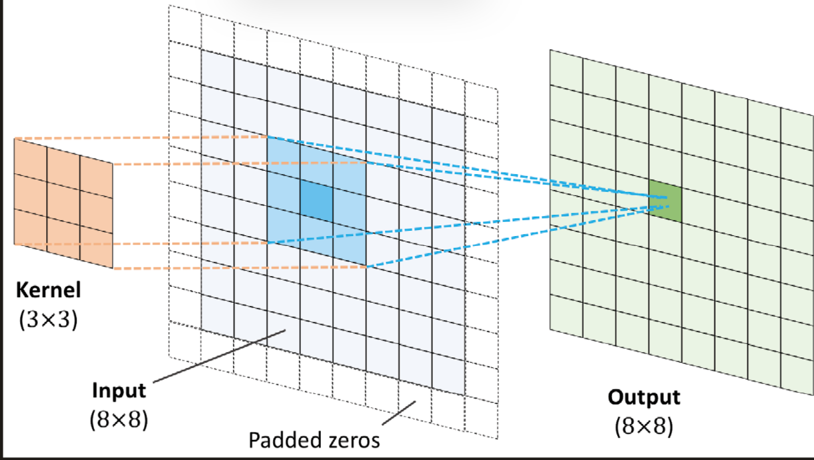
the output of a 2d convulation 
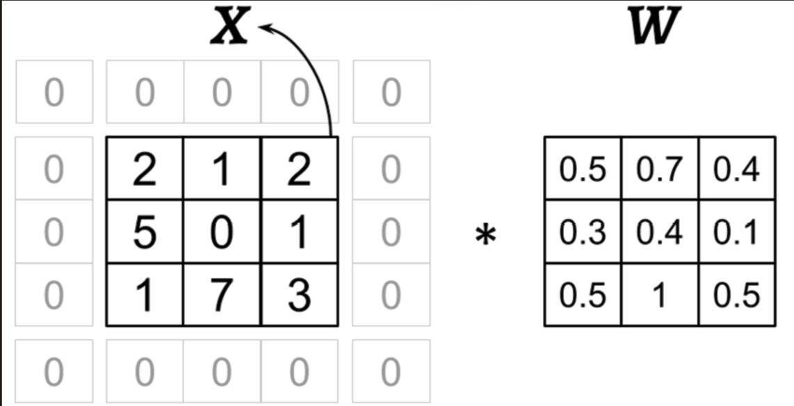
https://arxiv.org/abs/1509.09308

Implementimg cnn:
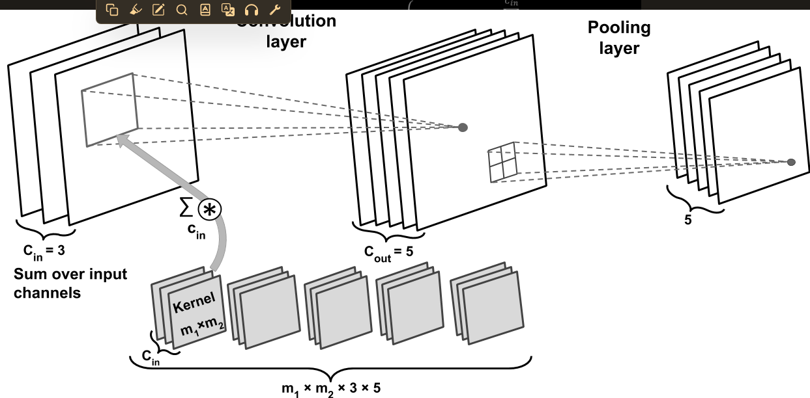
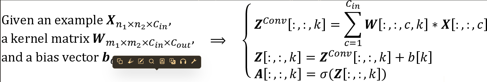

regularizing nn with l2
https://arxiv.org/abs/1711.05101.
http://www.jmlr.org/papers/volume15/srivastava14a/srivastava14a.pdf).
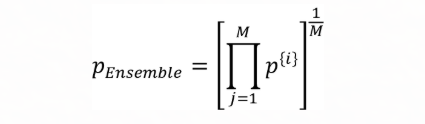

Implementing a deep CNN using PyTorch
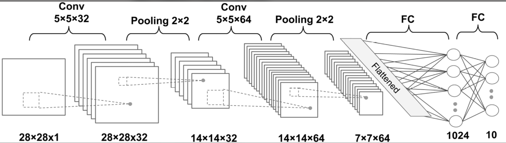
https://pytorch.org/docs/stable/generated/torch.nn.Conv2d.html.
the spatial dimension of the output feature map is calculated by: 
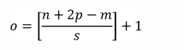
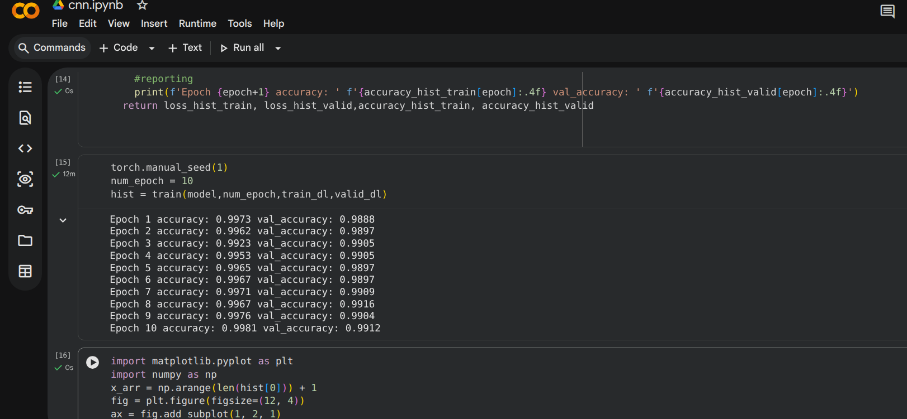
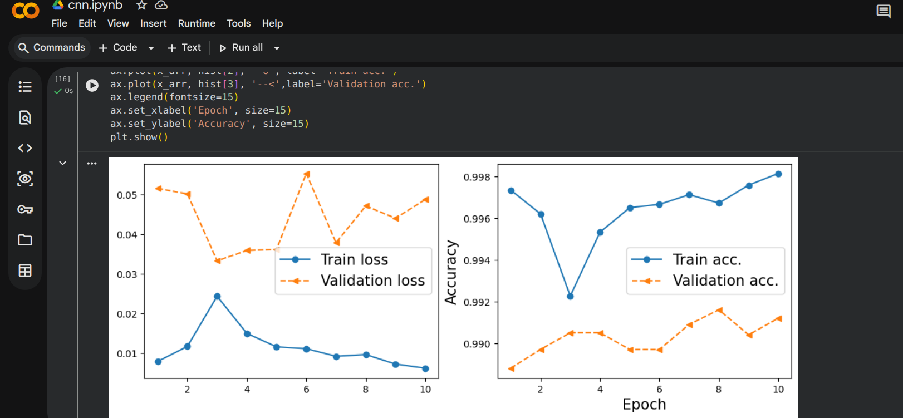
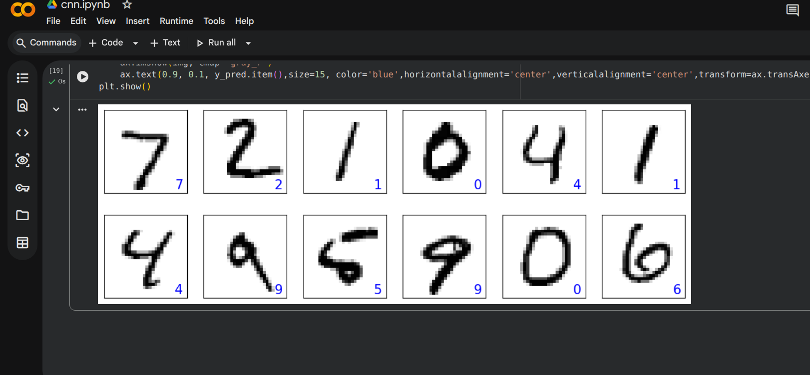

cnn in celeba face recognition
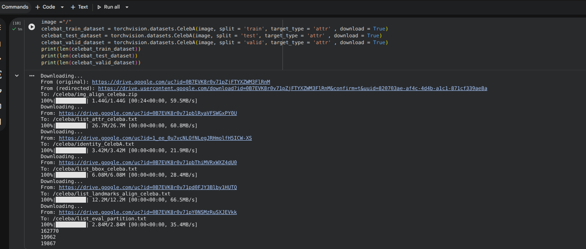
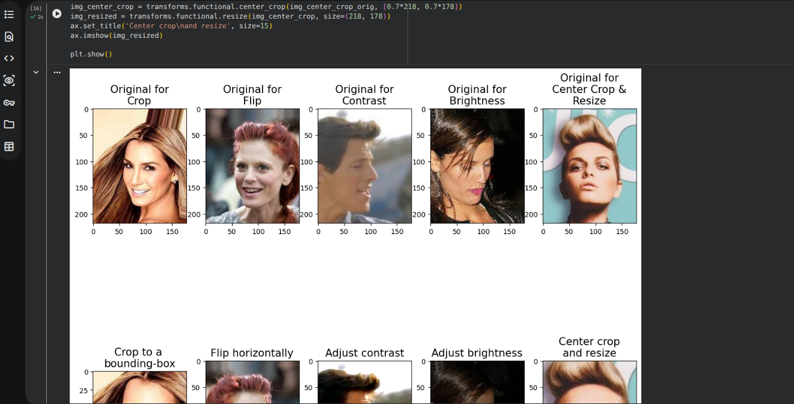
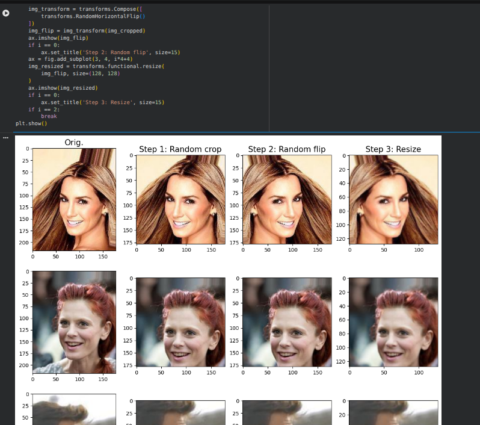